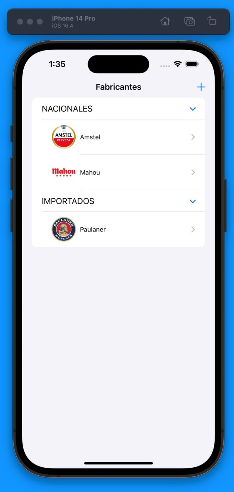
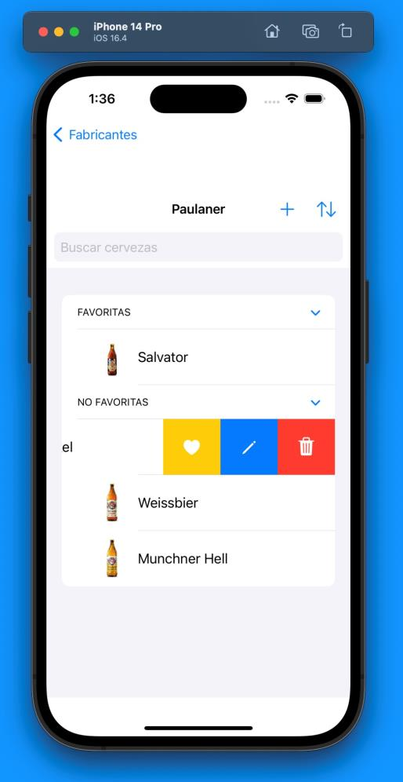
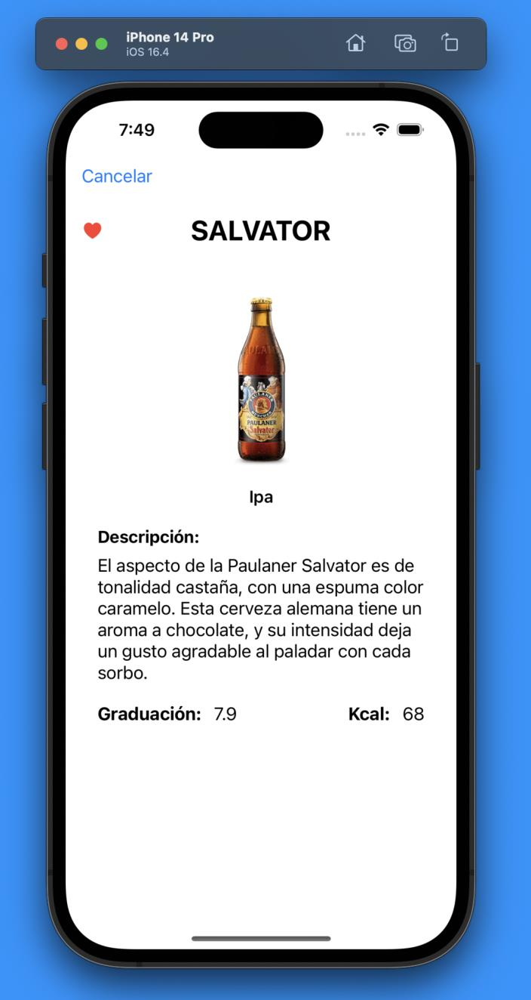

# Beer Center

iOS app for browsing and managing craft beer catalogs. Explore breweries, discover beers, mark favorites, and keep track of your collection — all backed by a REST API.

<div align="center">
  
  
  
</div>

## Features

- **Brewery management** — Add, view, and delete breweries organized by origin (national vs. imported), each with a name, type, and logo
- **Beer catalog** — Each brewery has its own beer list with name, type (Lager, Amber, IPA...), description, ABV, calories, and image
- **Favorites** — Mark beers as favorites with a dedicated section at the top of each brewery's list
- **Search & sort** — Filter beers by name, sort by name/ABV/type/calories in ascending or descending order
- **Swipe actions** — Swipe left to delete, edit, or toggle favorite on any beer or brewery
- **Image handling** — Logos loaded from URL or uploaded from the device's photo gallery (stored as compressed base64)

## Architecture

MVVM pattern with a REST API backend for all CRUD operations:

```
BeerCenterDAA/
├── BeerCenterDAAApp.swift        # App entry point
├── Modelo.swift                  # Data models (Fabricante, Cerveza)
├── APIService.swift              # REST API client (GET, POST, PUT, DELETE)
├── BeerCenterViewModel.swift     # Business logic and state management
├── Extensiones.swift             # URL validation and image helpers
├── ListaFabricantesView.swift    # Brewery list (main screen)
├── ListaCervezasView.swift       # Beer list per brewery
├── DetallesCervezaView.swift     # Beer detail view
├── AñadirFabricanteView.swift    # Add brewery form
├── AñadirCervezaView.swift       # Add beer form
└── ModificarCervezaView.swift    # Edit beer form
```

## Tech stack

- **SwiftUI** — Declarative UI framework
- **MVVM** — Clean separation of concerns
- **REST API** — Full CRUD via URLSession
- **AsyncImage** — Remote image loading
- **PhotosPicker** — Gallery image upload
- Xcode / iOS 16.4+

## Context

Built for the **Desarrollo de Aplicaciones Avanzadas (DAA)** course at Universidad de Salamanca.
